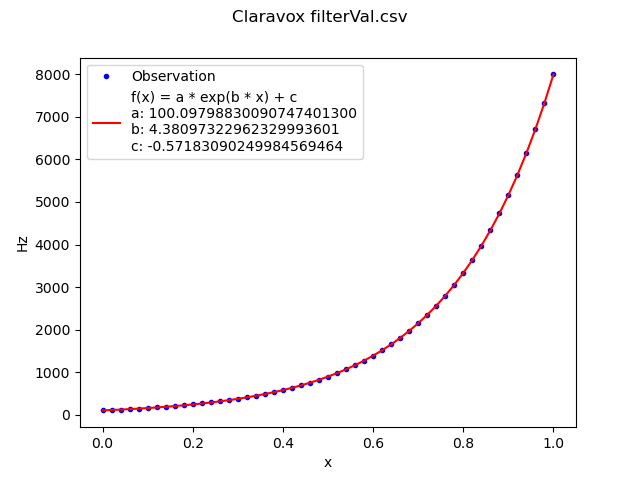
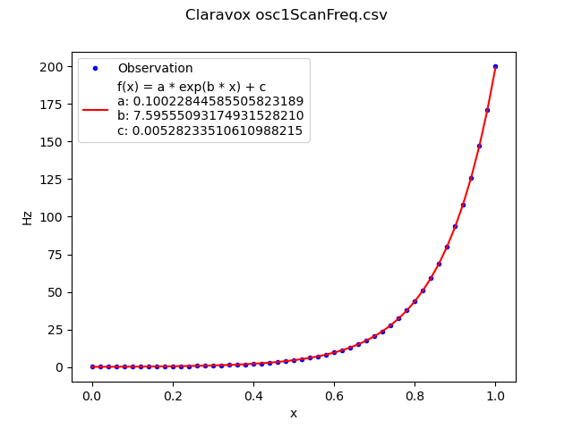
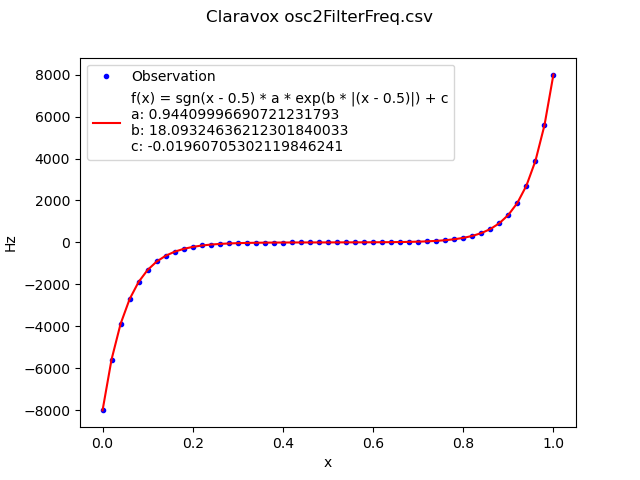

..
  Moog Claravox MIDI documentation

  NOTE: This document contains non-breaking spaces in order to control line
  breaks.

=========================
 Claravox MIDI interface 
=========================

Glossary
========
MIDI Channel In
    The instrument listens on this channel (0 = all channels, 1-16).
   
MIDI Channel Out
    The instrument sends on this channel (1-16).

App MIDI Channel
    The app sends and receives on this channel (1-16).

Undocumented messages
=====================
.. list-table:: Outgoing NRPNs
   :widths: auto
   :header-rows: 1

   * - Parameter
     - NRPN#
     - Range
     - Notes
   * - ?
     - 1011
     - ?
     - | Sent during initialization
       | Always 0
   * - ?
     - 1012
     - ?
     - | Sent during initialization
       | Always 0
   * - MIDI Resolution
     - 1025
     - 0 or 8192
     - | 0 = 7-bit resolution
       | 8192 = 14-bit resolution
   * - MIDI Channel In
     - 1026
     - 0-16
     - | 0 = Omni
       | 1 = Channel 1
       | ...
       | The app broadcasts this NRPN on all channels.
   * - MIDI Channel Out
     - 1027
     - 1-16
     - | 
   * - ?
     - 2383
     - ?
     - | Sent during initialization
       | Always 0
   * - ?
     - 2384
     - ?
     - | Sent during initialization
       | Always 0

.. list-table:: Incoming NRPNs
   :widths: auto
   :header-rows: 1

   * - Parameter
     - NRPN#
     - Range
     - Notes
   * - ?
     - 8
     - ?
     - |
   * - ?
     - 136
     - ?
     - |
   * - ?
     - 264
     - ?
     - |
   * - ?
     - 10130
     - ?
     - |
   * - Serial number
     - 10258
     - 0-16383
     - |
   * - ?
     - 14727
     - ?
     - |
   * - ?
     - 14855
     - ?
     - |

Undocumented Hz conversion
==========================
The internal representation of some parameters is not linear. To get a
human-readable representation, we need to know a function f(x) that maps the
raw parameter [0..1]. Moog does not document the conversion functions. I
resorted to observing Moog's app to get Hz values for the raw parameters,
guessed a suitable function f(x) and fitted coefficients algorithmically. The
results are not perfect. Expect minor deviations from what the Moog app
displays.

.. _function-filter-cutoff:

Filter Cutoff f(x)
------------------
::

    f(x) = a * e^(b * x) + c`
    a = 100.097988300907474013001774437725543975830078125
    b = 4.38097322962329993600860689184628427028656005859375
    c = -0.57183090249984569464203332245233468711376190185546875

.. _function-osc-scan-freq:

Oscillator 1/2 Scan Frequency f(x)
----------------------------------
::

    f(x) = a * e^(b * x) + c
    a = 0.10022844585505823189475194112674216739833354949951171875
    b = 7.5955509317493152821043622680008411407470703125
    c = 0.00528233510610988214739602852887401240877807140350341796875

.. _function-osc-filter-freq:

Oscillator 2 Filter Frequency f(x)
----------------------------------
::
    
    f(x) = sgn(x - 0.5) * a * exp(b * |(x - 0.5)|) + c
    a = 0.9440999669072123179347499899449758231639862060546875
    b = 18.09324636212301840032523614354431629180908203125
    c = -0.0196070530211984624113785713461766135878860950469970703125

Undocumented initialization CC
===================================
The app sends a sequence of unknown CCs during initialization:

::

    CC 118, Data 127
    CC 117, Data 0
    CC 117, Data 0
    CC 117, Data 28
    CC 117, Data 0
    CC 117, Data 0
    CC 117, Data 0
    CC 118, Data 126

The instruments responds with a large number of mostly unknown messages.

Documented messages
===================
The following tables are transcribed from the instrument's official documentation.

.. list-table:: Instrument parameters
   :widths: auto
   :header-rows: 1

   * - Parameter
     - CC#
     - NRPN#
     - Range
     - Notes
   * - Volume Response
     - 12
     - 412
     - 0 - 16383
     - | Bipolar (Center Value = 0)
       | Adjust the linearity of the Volume Antenna response (concave to convex).
   * - Pitch Response
     - 13
     - 413
     - 0 - 16383
     - | Bipolar (Center Value = 0)
       | Adjust the linearity of the Pitch Antenna response (concave to convex).
   * - Quantize Amount
     - 16
     - 416
     - 0 - 16383
     - Determines the level of quantization.
   * - Quantize Root
     - 85
     - 485
     - | 0 = C
       | 11 = C♯ (D♭)
       | 21 = D
       | 32 = D♯
       | 43 = E
       | 53 = F
       | 64 = F♯ (G♭)
       | 75 = G
       | 85 = G♯ (A♭)
       | 96 = A
       | 107 = A♯ (B♭)
       | 117 = B
     - Selects the root note (key) of the scale used for quantization.
   * - Quantize Scale
     - 86
     - 486
     - | 0 = Chromatic
       | 6 = Ionian
       | 12 = Minor Pentatonic
       | 17 = Fifth
       | 23 = Dorian
       | 29 = Phrygian
       | 35 = Lydian
       | 41 = Mixolydian
       | 47 = Aeolian
       | 52 = Locrian
       | 58 = Major Blues
       | 64 = Minor Blues
       | 70 = Diminished
       | 76 = Major Pentatonic
       | 81 = Spanish
       | 87 = Roma
       | 93 = Arabian
       | 99 = Egyptian
       | 105 = Ryukyu
       | 111 = Wholetone
       | 116 = Major Third
       | 122 = Minor Third
     - Selects the scale used for quantization.
   * - Register
     - 75
     - 475
     - | 0 = (-2)
       | 32 = (-1)
       | 64 = ( 0)
       | 96 = (+1)
     - Octave Offset for the Pitch Antenna
   * - Filter Cutoff
     - 19
     - 419
     - | 0 - 16383
       | Non-linear function: :ref:`function-filter-cutoff`.
     - | Analog VCF (Oscillator 1 only)
   * - Brightness
     - 17
     - 417
     - 0 - 16383
     - Analog Harmonic Enhancement (Oscillator 1 only)
   * - Wave
     - 18
     - 418
     - 0 - 16383
     - Analog Waveshaper (Oscillator 1 only)
   * - Delay Time
     - 20
     - 420
     - 0 - 16383
     - Adjusts the Delay Time (70ms to 700ms).
   * - Delay Mix
     - 21
     - 421
     - 0 - 16383
     - Adjusts the Delay Wet/Dry mix.
   * - Delay Feedback
     - 22
     - 422
     - 0 - 16383
     - Adjusts the Delay Feedback amount.
   * - Pitch Antenna Scan Freq Mod Amount
     - 72
     - 472
     - 0 - 127
     - | Bipolar (Center Value = 0)
       | This parameter controls the depth of the PITCH CV signal used to modulate the frequency at which the oscillators' wavetable is scanned.
   * - Pitch Antenna Scan Pos Mod Amount
     - 73
     - 473
     - 0 - 127
     - | Bipolar (Center Value = 0)
       | This parameter controls the depth of the PITCH CV signal used to modulate the scan position of the oscillators' wavetable.
   * - Oscillator 1 Mode
     - 81
     - 481
     - 0 - 96
     - | Selects the mode for Oscillator 1.
   * - Oscillator 1 Level
     - 25
     - 425
     - 0 - 16383
     - | Selects the level for Oscillator 1.
   * - Oscillator 1 Wavetable
     - 83
     - 483
     - | 0 = Wavetable 1
       | 16 = Wavetable 2
       | 32 = Wavetable 3
       | 48 = Wavetable 4
       | 64 = Wavetable 5
       | 80 = Wavetable 6
       | 96 = Wavetable 7
       | 112 = Wavetable 8
     - | Selects the Wavetable in use for Oscillator 1, when the Oscillator 1 MODE is set to Wavetable (102).
   * - Oscillator 1 Scan Position (Center)
     - 87
     - 487
     - 0 - 127
     - | Specifies the starting position for scanning back and forth through the selected Wavetable.
   * - Oscillator 1 Scan Frequency
     - 23
     - 423
     - | 0 - 16383
       | Non-linear function: :ref:`function-osc-scan-freq`.
     - | Adjusts the rate for scanning back and forth through the selected Wavetable (0.1 Hz to 100 Hz).
   * - Oscillator 1 Scan Amount (Width)
     - 89
     - 489
     - 0 - 127
     - | Sets the width of the Wavetable scanning window (0 to full frame).
   * - Oscillator 2 Beat Frequency
     - 28
     - 428
     - 0 - 127
     - | Bipolar (Center Value = 0)
       | Linear offset (-10Hz to +10Hz) for the secondary oscillator frequency relative to the primary.
   * - Oscillator 2 Semitone Offset
     - 27
     - 427
     - 0 - 127
     - | Bipolar (Center Value = 0)
       | Musical-pitch offset (-12 semitones to +12 semitones) for the secondary oscillator relative to the primary.
   * - Oscillator 2 Level
     - 26
     - 426
     - 0 - 16383
     - | Specifies the level of Oscillator 2.
   * - Noise Level
     - 9
     - 409
     - 0 - 16383
     - | Specifies the level of the Noise source sent to the Filter of Oscillator 2.
   * - Oscillator 2 Wavetable
     - 82
     - 482
     - | 0 = Wavetable 1
       | 16 = Wavetable 2
       | 32 = Wavetable 3
       | 48 = Wavetable 4
       | 64 = Wavetable 5
       | 80 = Wavetable 6
       | 96 = Wavetable 7
       | 112 = Wavetable 8
     - | Selects the Wavetable in use for Oscillator 2, when the Oscillator 2 MODE is set to Wavetable (102).
   * - Oscillator 2 Scan Position (Center)
     - 88
     - 488
     - 0 - 127
     - | Specifies the starting position for scanning back and forth through the selected Wavetable.
   * - Oscillator 2 Scan Frequency
     - 24
     - 424
     - | 0 - 16383
       | Non-linear function: :ref:`function-osc-scan-freq`.
     - | Adjusts the rate for scanning back and forth through the selected Wavetable (0.1 Hz to 100 Hz).
   * - Oscillator 2 Scan Amount (Width)
     - 90
     - 490
     - 0 - 127
     - | Sets the width of the Wavetable scanning window (0 to full frame).
   * - Oscillator 2 Filter Offset
     - 8
     - 408
     - 0 - 16383
     - | Sets the Cutoff Frequency of the two-pole State-Variable Filter (SVF) affecting Oscillator 2 and Noise.
       | Non-linear function: :ref:`function-osc-filter-freq`.
   * - Oscillator 2 Filter Mode
     - 91
     - 491
     - | 0 = Low Pass
       | 32 = High Pass
       | 64 = Band Pass
       | 96 = Notch (Band Reject)
     - | Sets the Filter mode of the two-pole State-Variable Filter (SVF) affecting Oscillator 2 and Noise.
   * - Oscillator 2 Filter Resonance (Q)
     - 10
     - 410
     - 0 - 16383
     - | Sets the Resonance Amount of the two-pole State-Variable Filter (SVF) affecting Oscillator 2 and Noise.
   * - Oscillator 2 Filter Enable
     - 103
     - 503
     - | 0 = Off
       | 64 = On
     - | Determines whether or not the Oscillator 2 Filter is applied to Oscillator 2 and the Noise Source.
   * - Oscillator 1 Pitch Filter Tracking Amount
     - 2
     - 402
     - 0 - 16383
     - | Bipolar (Center Value/MSB 64 = 0)
       | Determines how much the Pitch Antenna value changes the Cutoff Frequency of the Oscillator 1 Filter.
   * - Oscillator 2 Pitch Filter Tracking Amount
     - 3
     - 403
     - 0 - 16383
     - | Bipolar (Center Value/MSB 64 = 0)
       | Determines how much the Pitch Antenna value changes the Cutoff Frequency of the Oscillator 2 Filter.
   * - Oscillator 1 Volume Filter Tracking Amount
     - 4
     - 404
     - 0 - 16383
     - | Bipolar (Center Value/MSB 64 = 0)
       | Determines how much the Volume Antenna value changes the Cut-off Frequency of the Oscillator 1 Filter.
   * - Oscillator 2 Volume Filter Tracking Amount
     - 5
     - 405
     - 0 - 16383
     - | Bipolar (Center Value/MSB 64 = 0)
       | Determines how much the Volume Antenna value changes the Cut-off Frequency of the Oscillator 2 Filter.
   * - Note Number Mode
     - 110
     - 510
     - | 0 = Fixed
       | 64 = Chromatic
     - | Determines whether MIDI pitch control messages will be sent via Fixed mode or Chromatic mode.
   * - MIDI Pitch Out Enable
     - 108
     - 508
     - | 0 = Off
       | 64 = On
     - | Determines whether or not MIDI Pitch data corresponding with Volume and Pitch antenna CV will be sent.
   * - Fixed Mode MIDI Note Number
     - 109
     - 509
     - 0 - 127
     - | Set the base Note Number that will be used for MIDI Note On when in Pitch Move mode.

.. list-table:: Instrument settings
   :widths: auto
   :header-rows: 1

   * - Parameter
     - CC#
     - NRPN#
     - Range
     - Notes
   * - Volume CV Output Scale
     - 30
     - 430
     - 0 - 16383
     - | Attenuates the max CV Output level available to the selected Volume CV Out Range. Negative values invert the output range.
   * - Volume CV Output Range
     - 104
     - 504
     - | 0 = -5V to +5V
       | 43 = 0V to +5V
       | 86 = 0V to +10V
     - | Sets the CV range found at the VOLUME OUT jack.
   * - Pitch CV Output Range
     - 93
     - 493
     - | 0 = -5V to +5V
       | 43 = 0V to +5V
       | 86 = 0V to +10V
     - | Sets the voltage range for the PITCH OUT CV jack.
   * - Pitch CV Out Quantize
     - 95
     - 495
     - | 0 = Pre-Quantization
       | 64 = Post-Quantization
     - | Selects if the value of the PITCH OUT CV jack is determined before or after any quantization.
   * - CV In Scale
     - 14
     - 414
     - 0 - 16383
     - | Scales the voltage of the CV IN jack plus/minus 100%; Center value = 0 output.
   * - CV In Offset
     - 29
     - 429
     - 0 - 16383
     - | This parameter provides an offset voltage that is added or subtracted from the CV Input Range.
   * - CV In Range
     - 92
     - 492
     - | 0 = -5V to +5V
       | 64 = 0V to +10V
     - | Sets the expected voltage range of the CV IN jack.
   * - Mute Mode
     - 107
     - 507
     - | 0 = Latching
       | 64 = Momentary
     - | Determines whether the panel MUTE jack toggles MUTE on/off with successive presses (latching), or mutes on press/unmutes on release (momentary).
   * - MIDI Note On Threshold
     - 111
     - 511
     - 0 - 16383
     - | Determines the Volume Antenna CV level at which a Note On/Off message will be sent. Note will remain On as long as Volume Antenna CV is above threshold, and will remain Off as long as Volume Antenna CV is below threshold.
   * - Volume Antenna Control Mode
     - 113
     - 513
     - | 0 = Volume Antenna Enabled
       | 43 = Enabled + Automute
       | 86 = Volume Antenna Disabled
     - | Determines whether the Volume Antenna is active, active with automute enabled, or disabled with external MIDI CC# 7 control of Volume enabled.
   * - Volume Antenna MIDI CC# Selection
     - N/A
     - 2501
     - | 0 = No Volume Antenna CC Output
       | 1-31 = Selects corresponding value for Volume Antenna CC Out #
     - | Determines which MIDI CC# is used to send values corresponding with Volume Antenna CV.

